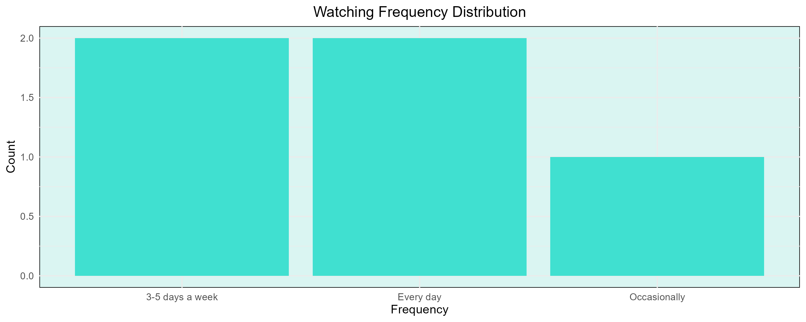
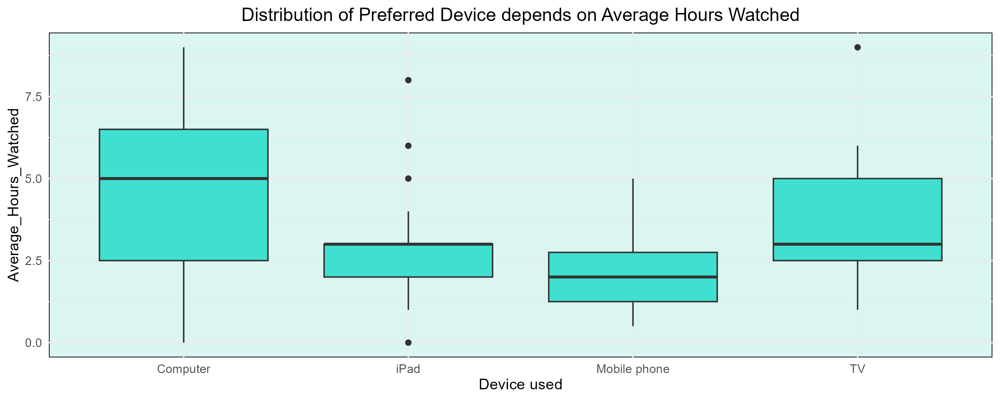
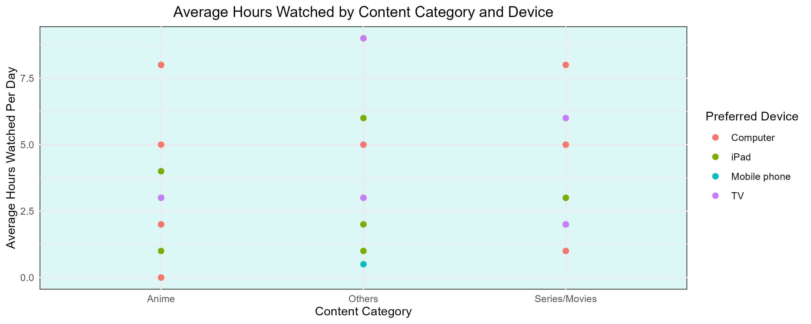

<script src="https://code.jquery.com/jquery-3.7.1.min.js" integrity="sha256-/JqT3SQfawRcv/BIHPThkBvs0OEvtFFmqPF/lYI/Cxo=" crossorigin="anonymous"></script>

```{r setup, include=FALSE}
knitr::opts_chunk$set(echo=FALSE, message=FALSE, warning=FALSE, error=FALSE)
```

```{js}
$(function() {
  $(".level2").css('visibility', 'hidden');
  $(".level2").first().css('visibility', 'visible');
  $(".container-fluid").height($(".container-fluid").height() + 300);
  $(window).on('scroll', function() {
    $('h2').each(function() {
      var h2Top = $(this).offset().top - $(window).scrollTop();
      var windowHeight = $(window).height();
      if (h2Top >= 0 && h2Top <= windowHeight / 2) {
        $(this).parent('div').css('visibility', 'visible');
      } else if (h2Top > windowHeight / 2) {
        $(this).parent('div').css('visibility', 'hidden');
      }
    });
  });
})
```

```{css}
.figcaption {display: none}
h1 {
    font-family: Impact, sans-serif;
    color:      		#31a354;
    background-color: #e5f5e0;
}
h2 {
    font-family: Impact, sans-serif;
    color:      		#31a354;
    background-color: #e5f5e0;
}
body {
    font-family: Arial;
    color:      		#31a354;
    background-color: #e5f5e0;
}

p {
    font-size: 16px;
}
```

## Introduction

In this visual data story, we explore how different people engage with watching online shows.  
The data was collected using a Google Form which asked respondents about their show watching frequency, preferred device, and content types.  
Our goal is to uncover viewing habits and preferences to understand how people balance their screen time with device choices.

## Watching Frequency Patterns



As seen in the bar chart above, watching shows is a frequent activity for many respondents.  
Most people reported watching either every day or 3-5 days a week.  
Only a few reported watching occasionally.  
This highlights the growing role of digital streaming in daily life.

## Device Usage and Viewing Hours



The boxplot reveals interesting differences in viewing habits across devices.  
Computer users tend to watch for longer hours, while mobile phone and iPad users report shorter average watching times.  
TV watchers fall in between, suggesting it remains a comfortable option for longer viewing sessions at home.

## Content Preferences Across Devices



The scatter plot above shows the relationship between content categories and devices.  
Regardless of whether people are watching Anime, Series/Movies, or Other content types, a variety of devices are used.  
This suggests that content choice does not strongly dictate device choice, allowing users to pick what is most convenient.

## Conclusion

From these insights, it is clear that online show watching is highly integrated into daily routines.  
Computer and TV remain the go-to devices for longer sessions, while phones and tablets serve lighter viewing needs.  
Understanding these patterns can help content providers and marketers tailor their services to audience habits.


